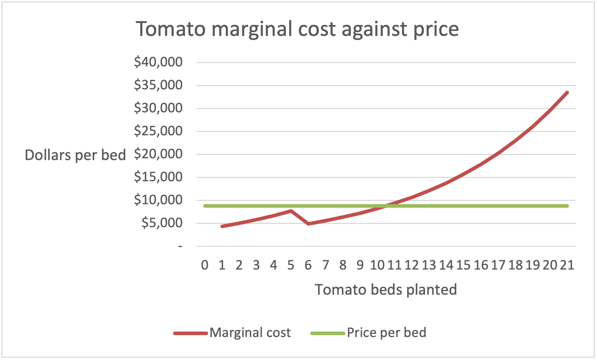
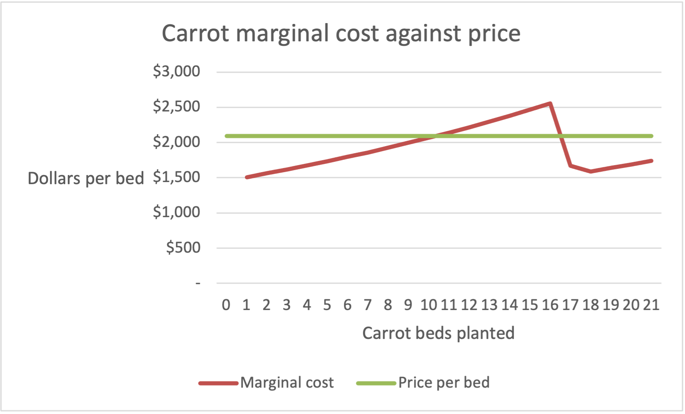
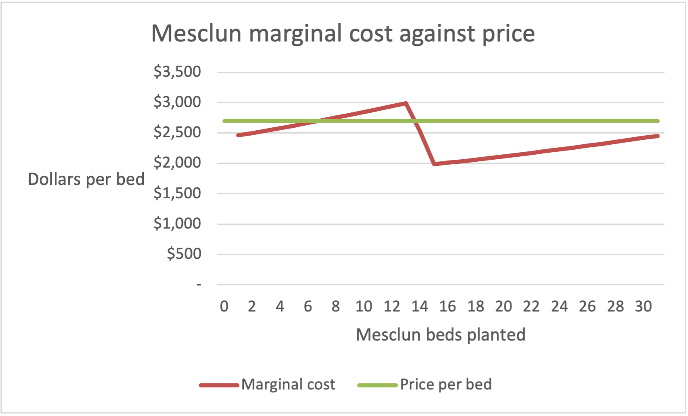

# Perfect competition — what the model found

The question was how many beds of each crop to plant. The model found the optimum
as 10 tomato, 20 carrot, 30 mesclun beds.

<!-- TODO (content): add the season profit and the recommendation in one line. -->

## Why tomatoes stop at 10 beds

Tomato MC at bed 10 is $8,249 (`MCSchedules F17`) and at bed 11 is $9,391
(`MCSchedules F18`). The price of $8,800 sits between the two.

<!-- TODO (content): why revenue per bed is not the decision variable — tomatoes
     earn $8,800 a bed against carrots' $2,094, yet get planted to half their cap.
     Then reference Figure 1 in a sentence that makes a claim. -->

## Which constraints bind, and what relaxing one is worth

Carrot MC at bed 21 is $1,741.51 (`MCSchedules P28`) against a price of $2,094 — a
gap of $352.49. Mesclun MC at bed 31 is $2,453.53 (`MCSchedules Z38`) against
$2,700 — a gap of $246.47. Marginal cost for both crops is still under price at the
cap, so the cap stopped them rather than the economics.

Each shadow price is computed two ways, and the two agree to the cent:

| | Cost engine route | PRICE − MC route |
|---|---|---|
| Carrot bed cap | $352.49 (`Checks C19`) | $352.49 (`Checks B21`) |
| Mesclun bed cap | $246.47 (`Checks C20`) | $246.47 (`Checks B22`) |

<!-- TODO (content): what the shadow prices mean as advice — which ground is worth
     buying first and what a bed of it is worth.

     TODO (content): SLACK CONSTRAINTS — 60 beds of 64 (Optimization B10),
     4,557.2 temp hours of 5,760 (B11), and why the headcount cell reading 4 of 4
     (B13) is not a binding constraint. Rubric checks this explicitly.

     TODO (content): the standalone-vs-optimum point. Figures 2 and 3 show carrot
     MC crossing price around bed 11 and mesclun around bed 7, yet the plan fills
     both to their caps. Explain why that is not a contradiction.

     TODO (content): reference Figures 2 and 3 in sentences that make claims. -->

## The tomato marginal cost dip at bed 6

The dip is caused by hours going up while cost goes down. Tomato labor hours at bed
4 are 527.1 (`MCSchedules B11`), within the farmer's 720. At bed 5 they are 724.7
(`B12`), so the farmer's hours run out inside that bed. At bed 6 they are 956.6
(`B13`), and every hour past 720 is temp labor. Marginal cost at bed 5 is $7,661
(`F12`) and at bed 6 it falls to $4,906 (`F13`). The marginal wage fell from $34.72
to $17.36 as temp workers took over from the farmer's more costly labor.

<!-- TODO (content): the general point — marginal cost reflects input prices as much
     as physical returns, and any cost curve with a step change in an input price
     will do this. Optionally: this dip is why your spec defines the crossing as the
     FIRST q where MC exceeds price rather than the last. -->

## Why grow crops that lose money on their own

The farmer pays $20,000 in fixed costs (`Inputs B15`). That is paid no matter what
is planted.

<!-- TODO (content): this section is a stub and the rubric checks it. Resolve the
     paradox: run any single crop alone against the full $20,000 and it loses money
     at every quantity, yet the plan fills carrots and mesclun to their caps.
     Needs MC vs AVC — price exceeds average variable cost on every crop, so every
     bed contributes toward fixed costs the farm owes anyway. Then one sentence on
     where the same reasoning shows up outside a farm. -->

## Against my Stage 1 hypothesis

I predicted a 5 / 10 / 20 mix, thinking the more expensive tomatoes would reach
P = MC before the two less costly crops, while saving on cheaper labor for the
carrot and mesclun beds. The model returned 10 / 20 / 30 — I was under by 5, 10 and
10 beds respectively.

<!-- TODO (content): both falsifiers fired and neither is named yet.

     Falsifier 1: "If any crop stops at its bed cap rather than where its marginal
     cost meets its price, my claim that escalating labor is the binding limit is
     wrong." Carrots and mesclun both did.

     Falsifier 2: "If the model returns more than 8 tomato beds, then tomato labor
     escalates more slowly than I think." It returned 10.

     Name the mechanism your prior got wrong, not just the number. Say what, if
     anything, the hypothesis got right. Do not revise the brief. -->

---

<!-- TODO: make this line accurate before committing. State who wrote what. -->
-Drafted with help from ... ; reviewed and edited by me.
