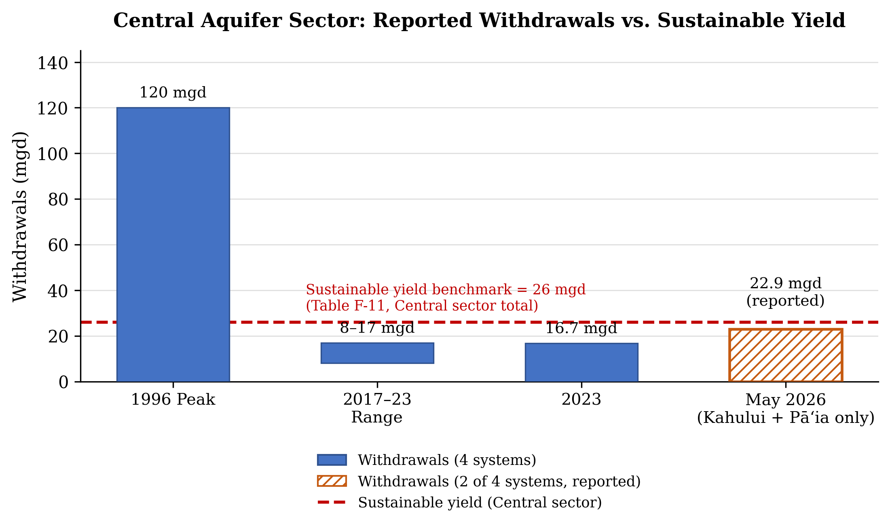

# Groundwater Extraction and the Contracting Recharge Subsidy in Central Maui

*First full draft. Transcribed from the working Word document; title-page and formatting
details live in that file, not here.*

## The Challenge

Central Maui's Kahului and Pā'ia aquifer sectors are being pumped above their published sustainable-yield figures. The latest 12-month moving average through May 31, 2026 reports about 7.760 mgd from Kahului against a 1 mgd sustainable yield, and 15.175 mgd from Pā'ia against 7 mgd — roughly 776% and 217% of yield (CWRM, 2019 WRPP, Table F-11; Maui Now, Sept. 2026, citing CWRM Deputy Director Ciara Kahahane). The same aquifer complex supports agriculture, Maui County's municipal system (Maui County DWS, Water Source Report, Feb. 10, 2026), and county-projected population growth through 2035 (Maui County DWS, WUDP Summary, Feb. 2025). Neither basin is designated a Ground Water Management Area, so CWRM cannot yet impose a volume cap through water-use permits (Haw. Rev. Stat. §174C-41). CWRM's 2019 plan notes these estimates ignore significant return irrigation that may replenish part of the pumped water (CWRM, 2019 WRPP, Table F-11). Extraction is unpriced and unmeasured against a current recharge benchmark, while the imported water providing that hidden recharge shrinks under drought.

## What the Sustainable-Yield Numbers Measure

The sustainable-yield number is a planning benchmark, not a real-time accounting of every gallon in an aquifer. CWRM's Table F-11 note is central: published yields for Kahului and Pā'ia ignore significant return irrigation (CWRM, 2019 WRPP, Table F-11) — water that seeps back and is later withdrawn, a service no metric measures. The 1 mgd and 7 mgd figures are primary CWRM planning values (CWRM, 2019 WRPP); the 7.760 mgd and 15.175 mgd figures are a moving average published by Maui Now, attributed to Deputy Director Kahahane (Maui Now, Sept. 2026) — reported, not primary, data.

The numbers also do not fully reconcile across time, and the underlying agency records should be verified before final submission. CWRM's May 2026 staff submittal reports the full Central sector — Kahului, Pā'ia, Makawao, and Kama'ole — withdrew 16.7 mgd in 2023, with Kahului alone at 5.2 mgd (CWRM Staff Submittal B2, May 19, 2026). The May 2026 average above covers only two of those four systems and already totals about 22.9 mgd. Part of the gap is scope, but combined withdrawals still appear to have grown substantially in under three years — whether from real growth, a reporting change, or both cannot be resolved from the record, itself evidence of the gap CWRM should close.

Maui lacks a transparent current water balance connecting pumping, imported deliveries, return flow, recharge, chloride, and water levels. That gap is itself an economic reason to designate Kahului and Pā'ia as Ground Water Management Areas.

## The Economics

Four mechanisms explain why the system can overpump despite physical uncertainty. First, groundwater is a common-pool resource: Mahi Pono, Maui County's DWS, and other well users draw from the same aquifer (Maui County DWS, Water Source Report, Feb. 10, 2026), and no single user can protect the shared lens alone. If freshwater is depleted, saltwater rises and contaminates it.

Second, extraction is a negative externality: pumping that lowers water levels or pulls the transition zone inland costs municipal customers and the public. The Central sector's systems are interconnected, so withdrawal in one affects flow elsewhere (USGS, Jan. 2025), though the record does not yet prove measurable chloride damage here. Third, groundwater is mispriced: a large user pays to operate a pump but not the scarcity cost imposed on future users. Fourth, imported surface water creates a recharge subsidy — return irrigation may replenish groundwater at no cost to the pumper (CWRM, 2019 WRPP, Table F-11) — unpriced until drought shrinks the flow.

## Implications — What Happens Next

If East Maui surface water diminishes, agriculture can substitute groundwater, preserving near-term production while drawing down the buffer return irrigation had created. The moving average can also stay elevated after conditions improve, since it still includes withdrawals from the preceding year.

Central Maui pumping reached a much higher reported peak of about 120 mgd in 1996, before sugarcane ended (CWRM Staff Submittal B2, May 19, 2026). The issue is not that today's rate is the highest ever — it is that pumping is high relative to published yield, the return-flow buffer is contracting, and the state lacks one updated system connecting pumping, deliveries, recharge, chloride, and water levels here. Without that measure, Maui will know only when saltwater intrusion happens.

## Recommendation

I recommend CWRM designate the Kahului and Pā'ia aquifer sectors as Ground Water Management Areas under Hawaiʻi Revised Statutes §174C-41, applied at the aquifer-sector level with coordination across Central Maui. The goal is not to declare every reported percentage physical overdraft, but to create the authority and data needed to determine the balance before the recharge buffer disappears.

CWRM should require large agricultural, commercial, and industrial users pumping over 100,000 gallons per day (0.1 mgd) to install audited digital meters — my proposed policy line, not an existing Hawaiʻi exemption. The threshold targets the few large users who account for most basin withdrawals, leaving domestic wells and small businesses outside the requirement and concentrating compliance costs where CWRM can monitor most easily.

The first year should establish a verified baseline of withdrawals, deliveries, return flow, water levels, and chloride; CWRM should then set a basin cap using updated sustainable-yield estimates. The fee would apply to withdrawals above each large user's permitted allotment, rising as basin withdrawals approach the cap. As an illustrative range, the fee might run $2–10 per 1,000 gallons above allotment; CWRM would set the final schedule once baseline data are verified. CWRM would administer permits, audit records, and penalize tampering; agricultural users get one year to comply.

Designation is therefore justified not because the existing sustainable-yield percentages are perfectly accurate, but because the State cannot responsibly manage a contracting recharge system it does not currently measure or regulate.

## Objections

The strongest objection is that overdraft appears overstated because imported surface water returns to the aquifer — a point CWRM's 2019 plan supports (CWRM, 2019 WRPP, Table F-11). If return flow is substantial, a cap based only on the old denominator could unnecessarily restrict agriculture and misdiagnose a recharge problem as a pumping problem. My response treats this as a reason for better measurement, not for preserving an unregulated basin: designation lets CWRM update the denominator and adjust the cap if data show balance.

The second objection is that CWRM funded a roughly $442,000 USGS study in May 2026 and should wait (CWRM Staff Submittal B2, May 19, 2026). Waiting leaves large users unregulated while the study proceeds. Designation and metering should begin now; CWRM can treat year one as a measurement period and revise the cap as better estimates arrive.

## Figure 1

*Figure 1. Central aquifer sector withdrawals against the CWRM sustainable-yield benchmark, 1996–May 2026. Bars show reported withdrawals at four points in the record (CWRM Staff Submittal B2, May 19, 2026; Maui Now, Sept. 2026); the dashed line marks the Central-sector sustainable-yield benchmark of 26 mgd (Kahului 1 + Pāʻia 7 + Makawao 7 + Kamaʻole 11, CWRM 2019 WRPP, Table F-11), which itself ignores return-irrigation recharge (Table F-11 caveat). The hatched bar for May 2026 covers only Kahului and Pāʻia — 2 of the 4 Central-sector systems — and is therefore not directly comparable to the 4-system totals shown for the other three points.*

## Figure 2

*Figure 2. Illustrative diagram of the mechanism described in “The Economics”: because pumping is unpriced, users extract to Qm, where demand meets only the marginal private cost (MPC), rather than to the efficient quantity Qs, where demand meets the marginal social cost (MSC). The orange bracket marks the unpriced externality at the current unregulated quantity — the wedge that designation and metering are meant to price in. Curve shapes are illustrative; they are not fitted to measured price or cost data for this basin, since none exists.*

## References

- Commission on Water Resource Management. Water Resource Protection Plan 2019 Update. Table F-11, aquifer notes for the Kahului and Pā'ia aquifer systems.

- Commission on Water Resource Management. Staff Submittal B2, May 19, 2026: Joint Funding Agreement with the U.S. Geological Survey, "Analysis of Groundwater Flow in the Central Aquifer Sector, Maui, Hawai'i."

- U.S. Geological Survey, Pacific Islands Water Science Center. "Analysis of Groundwater Flow in the Central Aquifer Sector, Maui, Hawai'i." January 2025. Exhibit 2 to CWRM Staff Submittal B2.

- U.S. Geological Survey. Hydrological Monitoring Needs Assessment for the State of Hawai'i. 2020.

- In re Water Use Permit Applications (Waiahole), 94 Haw. 97, 9 P.3d 409 (2000).

- Haw. Rev. Stat. §174C-41 (ground water management area designation); §174C-44 (designation criteria, including the ninety per cent of sustainable yield threshold); §174C-2(b).

- Maui Now. [Title], September 2026. [Reported CWRM 12-month moving average through May 31, 2026.]

- Anderson, Kay (Wailea 808). Testimony to the Commission on Water Resource Management, May 19, 2026. [Advocacy testimony.]

- Maui County Department of Water Supply. Water Source Report, February 10, 2026.

- Maui County Department of Water Supply. Water Use and Development Plan – Summary Document (WUDP Summary). February 2025.

---

-Drafted with help from Claude (Anthropic, 2026); reviewed and edited by me.
