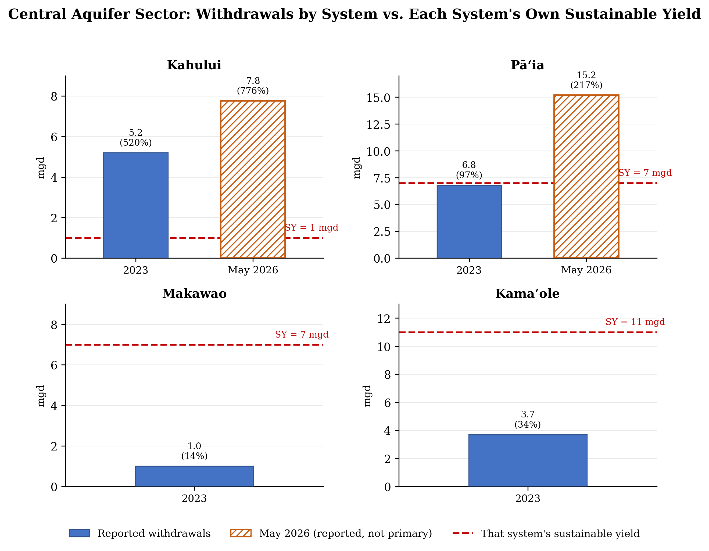
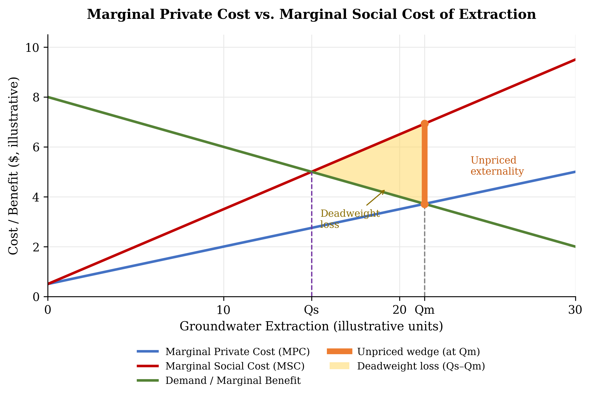

# Groundwater Extraction and the Contracting Recharge Subsidy in Central Maui

*Second draft. Rebuilds Figure 1 by aquifer system after the first version's
sector-level chart showed the basin inside its combined yield — the opposite of the
argument. Adds the aggregation objection, the public-trust ground for permitting
existing users, and the elasticity limit on the fee.*

## The Challenge

Central Maui's Kahului and Pā'ia aquifer systems are being pumped above their published sustainable-yield figures. The latest 12-month moving average through May 31, 2026 reports about 7.760 mgd from Kahului and 15.175 mgd from Pā'ia (Maui Now, Sept. 2026, citing CWRM Deputy Director Ciara Kahahane) — against sustainable yields of 1 mgd and 7 mgd, respectively (CWRM, 2019 WRPP, Table F-11), or roughly 776% and 217% of yield. The same aquifer complex supports agriculture, Maui County's municipal system (Maui County DWS, Water Source Report, Feb. 10, 2026), and county-projected population growth through 2035 (Maui County DWS, WUDP Summary, Feb. 2025). Neither system is designated a Ground Water Management Area, so CWRM cannot yet impose a volume cap through water-use permits (Haw. Rev. Stat. §174C-41). Extraction is unpriced and unmeasured against a current recharge benchmark, while the imported water that may be providing that recharge shrinks under drought.

## What the Sustainable-Yield Numbers Measure

The sustainable-yield number is a planning benchmark, not a real-time accounting of every gallon in an aquifer. CWRM's Table F-11 note is central: published yields for Kahului and Pā'ia ignore significant return irrigation (CWRM, 2019 WRPP, Table F-11), water that seeps back and is later withdrawn unmetered. The 1 mgd and 7 mgd figures are primary CWRM values (CWRM, 2019 WRPP); the 7.760 mgd and 15.175 mgd figures are a moving average from Maui Now (Sept. 2026) — reported, not primary, data.

The numbers also do not fully reconcile across time. CWRM's May 2026 staff submittal reports the full Central sector — Kahului, Pā'ia, Makawao, and Kama'ole — withdrew 16.7 mgd in 2023, with Kahului alone at 5.2 mgd (CWRM Staff Submittal B2, May 19, 2026). The May 2026 average above covers only two of those four systems and already totals about 22.9 mgd. Part of the gap is scope, but the growth in under three years cannot be fully explained by scope alone — itself evidence of the gap CWRM should close.

## The Economics

Four mechanisms explain why the system can overpump despite physical uncertainty. First, groundwater is a common-pool resource: Mahi Pono, Maui County's DWS, and other well users draw from the same aquifer (Maui County DWS, Water Source Report, Feb. 10, 2026), and no single user can protect the shared lens alone. If freshwater is depleted, saltwater rises and contaminates it.

Second, extraction is a negative externality: pumping that lowers water levels or pulls the transition zone inland costs municipal customers and the public, though the record does not yet prove measurable chloride damage here (USGS, Jan. 2025). Third, groundwater is mispriced: a large user pays to operate a pump but not the scarcity cost imposed on future users. Fourth, return irrigation may replenish groundwater at no cost to the pumper (CWRM, 2019 WRPP, Table F-11), unpriced until drought shrinks the flow.

## Implications — What Happens Next

If East Maui surface water diminishes, agriculture can substitute groundwater, preserving near-term production while drawing down the buffer return irrigation had created.

Central Maui pumping reached a much higher reported peak of about 120 mgd in 1996, before sugarcane ended (CWRM Staff Submittal B2, May 19, 2026). The issue is not that today's rate is the highest ever — it is that pumping is high relative to published yield, the return-flow buffer is contracting, and the state lacks one updated system connecting pumping, deliveries, recharge, chloride, and water levels here. No deep monitor wells exist in the study area to track the freshwater lens or transition zone (USGS, Jan. 2025), and USGS ranks all four Central-sector systems high priority for monitoring (USGS, Monitoring Needs Assessment, 2020) — a documented monitoring gap, not a demonstrated harm, and the one this paper asks CWRM to close.

## Recommendation

I recommend CWRM designate the Kahului and Pā'ia aquifer systems as Ground Water Management Areas under Hawaiʻi Revised Statutes §174C-41, coordinating with the Central aquifer sector where flows connect them. Permitting existing users regulates a public resource rather than taking a private one: the State holds all water in trust and there are no vested rights in the use of public water (In re Water Use Permit Applications, 94 Haw. 97 (2000); Haw. Rev. Stat. §174C-2(b)). Kahului alone clears the statutory 90%-of-sustainable-yield designation trigger (§174C-44) on every reported vintage — 520–776% of its 1 mgd yield is not a marginal case.

CWRM should require large agricultural, commercial, and industrial users pumping over 100,000 gallons per day (0.1 mgd) to install audited digital meters — my proposed line, not an existing exemption. The threshold targets the few large users who account for most withdrawals and leaves small users outside it.

The first year should establish a verified baseline of withdrawals, deliveries, return flow, water levels, and chloride; CWRM should then set a basin cap using updated sustainable-yield estimates. The fee applies to withdrawals above each large user's permitted allotment, rising toward the cap — illustratively, $2–10 per 1,000 gallons above allotment, with the final schedule set once baseline data are verified. CWRM would administer permits, audit records, and penalize tampering; agricultural users get one year to comply.

The cap does the binding work here, not the fee: once East Maui deliveries fall, groundwater has few near-term substitutes, so demand is only weakly price-responsive and the fee alone would mostly transfer revenue rather than reduce withdrawals. Its purpose is to fund monitoring and ration marginal use once the cap binds.

Designation is therefore justified not because the existing sustainable-yield percentages are perfectly accurate, but because the State cannot responsibly manage a contracting recharge system it does not currently measure or regulate.

## Objections

The strongest objection is that overdraft appears overstated because imported surface water returns to the aquifer (CWRM, 2019 WRPP, Table F-11), and a cap based on the old denominator could restrict agriculture unnecessarily. My response: this argues for better measurement, not an unregulated basin — designation lets CWRM update the denominator and adjust the cap if data show balance.

A second objection is that Figure 3's sector total cuts against this paper: Central-sector withdrawals sit comfortably under the combined 26 mgd sustainable yield. That holds only if the sector, not the system, is the right regulatory unit. It is not: CWRM sets and measures yields at the system scale — Kahului's 1 mgd yield is a system-level number — so Kamaʻole's unused 11 mgd offsets Kahului's deficit on paper without moving water to Kahului's wells. Return flow crossing boundaries justifies modeling recharge at the sector scale, not regulating at it — designation should track the unit CWRM licenses and measures, which is why this paper targets Kahului and Pāʻia specifically (Figure 1), not the sector.

A third objection is that CWRM funded a roughly $442,000 USGS study in May 2026, so some will argue for waiting (CWRM Staff Submittal B2, May 19, 2026). Waiting leaves large users unregulated meanwhile; designation should begin now, with year one as a measurement period and the cap revised as better estimates arrive.

## Figure 1

*Figure 1. Reported withdrawals by aquifer system against each system's own CWRM sustainable-yield benchmark (CWRM, 2019 WRPP, Table F-11; CWRM Staff Submittal B2, May 19, 2026; Maui Now, Sept. 2026). Kahului exceeds its 1 mgd yield by 520–776% across every reported vintage; Pāʻia is near its 7 mgd yield in 2023 and over it by May 2026; Makawao and Kamaʻole sit well under their own yields (Kamaʻole's 2023 figure is computed as the Central-sector remainder). Aggregating to the Central-sector level, as Figure 3 does, obscures this: Kamaʻole's unused allowance offsets Kahului's deficit on paper without moving water to wells near Kahului. May 2026 bars (hatched) cover only Kahului and Pāʻia and are reported, not primary, data.*

## Figure 2

*Figure 2. Illustrative diagram of the mechanism described in “The Economics”: because pumping is unpriced, users extract to Qm, where demand meets only the marginal private cost (MPC), rather than to the efficient quantity Qs, where demand meets the marginal social cost (MSC). The orange bracket marks the unpriced externality at Qm; the shaded triangle is the resulting deadweight loss. Curve shapes are illustrative and not fitted to measured cost data, since none exists; the downward-sloping demand curve is a simplification — as “Implications” notes, agriculture substitutes groundwater for surface water when deliveries fall, so demand may be closer to vertical in practice, which is why this paper treats the quantity cap, not the fee, as the instrument that does the binding work.*

## Figure 3

*Figure 3. Central aquifer sector withdrawals against the Central-sector sustainable-yield benchmark, 1996–May 2026 (CWRM Staff Submittal B2, May 19, 2026; Maui Now, Sept. 2026). Shown for long-run context only: today's sector-level withdrawals are well below the 1996 peak and, on this aggregated view, under the combined 26 mgd yield. That is precisely the aggregation problem Figure 1 and Objections address — the sector total is compliant while Kahului, individually, is not.*

## References

- Commission on Water Resource Management. Water Resource Protection Plan 2019 Update. Table F-11, aquifer notes for the Kahului and Pā'ia aquifer systems.

- Commission on Water Resource Management. Staff Submittal B2, May 19, 2026: Joint Funding Agreement with the U.S. Geological Survey, "Analysis of Groundwater Flow in the Central Aquifer Sector, Maui, Hawai'i."

- U.S. Geological Survey, Pacific Islands Water Science Center. "Analysis of Groundwater Flow in the Central Aquifer Sector, Maui, Hawai'i." January 2025. Exhibit 2 to CWRM Staff Submittal B2.

- U.S. Geological Survey. Hydrological Monitoring Needs Assessment for the State of Hawai'i. 2020.

- In re Water Use Permit Applications (Waiahole), 94 Haw. 97, 9 P.3d 409 (2000).

- Haw. Rev. Stat. §174C-41 (ground water management area designation); §174C-44 (designation criteria, including the ninety per cent of sustainable yield threshold); §174C-2(b).

- Maui Now. [Title], September 2026. [Reported CWRM 12-month moving average through May 31, 2026.]

- Maui County Department of Water Supply. Water Source Report, February 10, 2026.

- Maui County Department of Water Supply. Water Use and Development Plan – Summary Document (WUDP Summary). February 2025.

---

-Drafted with help from Claude (Anthropic, 2026); reviewed and edited by me.
